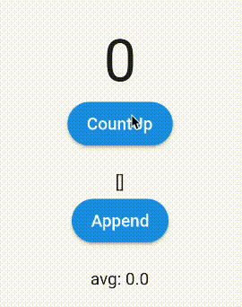

# counter-demo-flutter

## 概要
[riverpod](https://pub.dev/packages/riverpod) + [hooks_riverpod](https://pub.dev/packages/hooks_riverpod) を使ったカウンターのデモアプリ。教則用。

このリポジトリの並びに、 [counter-demo-nuxt](https://github.com/torico-tokyo/counter-demo-nuxt) というプロジェクトがあり、まったく同じ機能を提供している。

[counter-demo-nuxt の master](https://github.com/torico-tokyo/counter-demo-nuxt) ブランチ では、Vuex + typed-vuex で[ストア](https://github.com/torico-tokyo/counter-demo-nuxt/blob/master/store/counter.ts)を提供している。

対して、こちらの Flutter アプリは、 [riverpod](https://pub.dev/packages/riverpod) + [hooks_riverpod](https://pub.dev/packages/hooks_riverpod) で[状態管理](https://github.com/torico-tokyo/counter-demo-flutter/blob/master/lib/controllers/counter_controller.dart)をしている。

riverpod + hooks_riverpod での状態管理は、 [vuex の状態管理](https://github.com/torico-tokyo/counter-demo-nuxt/blob/master/store/counter.ts) と 1:1 で書けるので、比較すると非常に理解が早い。

## 比較

### 状態管理
- [Vue typed-vuex](https://github.com/torico-tokyo/counter-demo-nuxt/blob/master/store/counter.ts)
- [Vue vuex-module-decorators](https://github.com/torico-tokyo/counter-demo-nuxt/blob/vuex-module-decorators/store/counter.ts)
- [Flutter hooks_riverpod](https://github.com/torico-tokyo/counter-demo-flutter/blob/master/lib/controllers/counter_controller.dart)

### UI
- [Vue typed-vuex](https://github.com/torico-tokyo/counter-demo-nuxt/blob/master/pages/index.vue)
- [Vue vuex-module-decorators](https://github.com/torico-tokyo/counter-demo-nuxt/blob/vuex-module-decorators/pages/index.vue)
- [Flutter hooks_riverpod](https://github.com/torico-tokyo/counter-demo-flutter/blob/master/lib/main.dart)
